<p align="center">
  <samp>
  <a href="https://icebreaker.top" target="_blank">icebreaker.top</a> |
  <a href="https://www.npmjs.com/package/sonofmagic" target="_blank">npx -y sonofmagic@latest</a> |
  <a href="https://github.com/sonofmagic/sponsors" target="_blank">sponsor/赞助</a>
  </samp>
</p>

<details>

<summary>More Details</summary>

|                         <a href="https://www.icebreaker.top/" target="_blank"></a>                         |   <a href="https://u.wechat.com/EAVzgOGBnATKcePfVWr_QyQ" target="_blank"></a>&nbsp;备注: Github  |
| :-------------------------------------------------------------------------------------------------------------------------------------------------------------------------------------------------------: | :------------------------------------------------------------------------------------------------------------------------------------------------------------------------------------------: |
|  |  |

```text
+--------------------------------------------------------------------------------------------------------------------------------------------------------------------------------------------------------------------------------------------------------------------------------------------------------------------------------------------------------------+
| #####    #      #      #    #####   ####  #      #      #       ####  #####  #      ####   #      #####  ####   #   #  ####   #   #  ####   ####   #   #  ####   #  #   #   #  #####  #      ####   #      #####   ###   #   #  #####  #   #  #   #  #   #  #  #   ###    #  #   #   #  #####  #      ####   #      #####  ####   #   #  ####   #  #   #   # |
| #####    #      #      #    #####   ####  #      #      #       ####  #####  #      ####   #      #####  ####   #   #  ####   #   #  ####   ####   #   #  ####   #  #   #   #  #####  #      ####   #      #####   ###   #   #  #####  #   #  #   #  #   #  #  #   ###    #  #   #   #  #####  #      ####   #      #####  ####   #   #  ####   #  #   #   # |
| #####    #      #      #    #####   ####  #      #      #       ####  #####  #      ####   #      #####  ####   #   #  ####   #   #  ####   ####   #   #  ####   #  #   #   #  #####  #      ####   #      #####   ###   #   #  #####  #   #  #   #  #   #  #  #   ###    #  #   #   #  #####  #      ####   #      #####  ####   #   #  ####   #  #   #   # |
| #####    #      #      #    #####   ####  #      #      #       ####  #####  #      ####   #      #####  ####   #   #  ####   #   #  ####   ####   #   #  ####   #  #   #   #  #####  #      ####   #      #####   ###   #   #  #####  #   #  #   #  #   #  #  #   ###    #  #   #   #  #####  #      ####   #      #####  ####   #   #  ####   #  #   #   # |
| #####    #      #      #    #####   ####  #      #      #       ####  #####  #      ####   #      #####  ####   #   #  ####   #   #  ####   ####   #   #  ####   #  #   #   #  #####  #      ####   #      #####   ###   #   #  #####  #   #  #   #  #   #  #  #   ###    #  #   #   #  #####  #      ####   #      #####  ####   #   #  ####   #  #   #   # |
|                                                                                                                                                                                                                                                                                                                                                              |
|                                                                                                                                                                      updated 2026-03-19                                                                                                                                                                      |
+--------------------------------------------------------------------------------------------------------------------------------------------------------------------------------------------------------------------------------------------------------------------------------------------------------------------------------------------------------------+
```

auto generated by Github Actions at 2026-03-19

Powered by [`sonofmagic/github-readme-svg`](https://github.com/sonofmagic/github-readme-svg), [`sonofmagic/ascii-art-avatar`](https://github.com/sonofmagic/ascii-art-avatar) and [`sonofmagic/sonofmagic`](https://github.com/sonofmagic/sonofmagic)

<a href="https://www.icebreaker.top/" target="_blank"></a>


</details>
