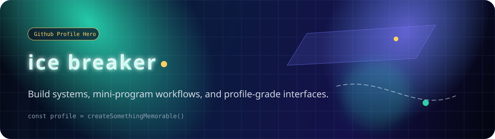

  <samp>把 Vite / Tailwind 编译进不是浏览器的运行时。</samp>

  <samp>
  <a href="https://github.com/weapp-vite/weapp-vite">weapp-vite</a> ·
  <a href="https://github.com/sonofmagic/weapp-tailwindcss">weapp-tailwindcss</a> ·
  <a href="https://2026.vueconf.sonofmagic.top/">VueConf 2026</a>
  </samp>

  <samp>
  <a href="https://icebreaker.top" target="_blank">icebreaker.top</a> |
  <a href="https://www.npmjs.com/package/sonofmagic" target="_blank">npx -y sonofmagic@latest</a> |
  <a href="https://github.com/sonofmagic/sponsors" target="_blank">sponsor/赞助</a>
  </samp>

More Details

  

